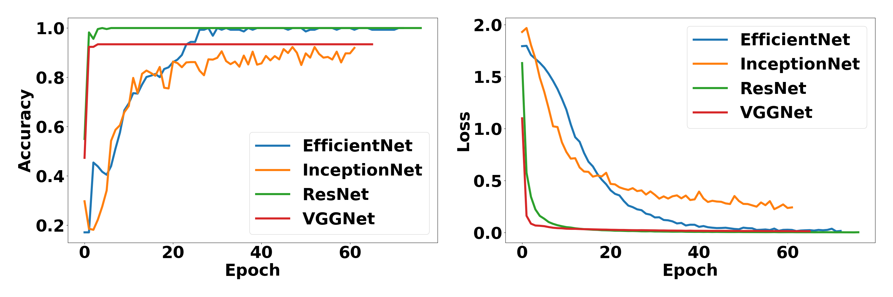
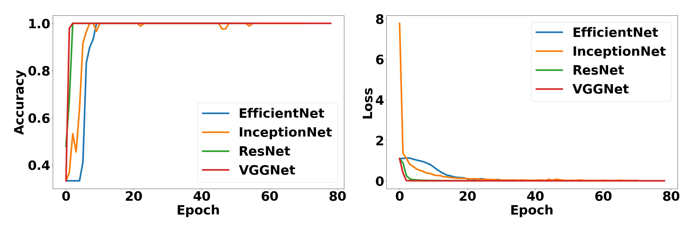
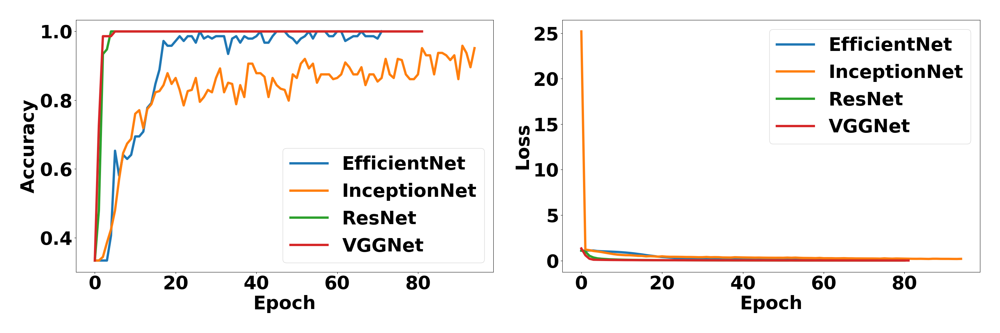

# Internal Pipe Corrosion Assessment with Ultrasound and CNNs

This study introduces a dual-mode methodology for quantifying pipe corrosion by employing ultrasound technology in conjunction with convolutional neural networks (CNN).
The codes include components for data handling, model development, preprocessing, and utility functions.

***

### Components

-   **Data**:

    -   `data/`: Directory containing the original ultrasound data.

-   **Data Handling**:

    -   `data.py`: Functions for loading datasets.

-   **Model Development**:

    -   `model/`: Directory containing various CNN architectures:
        -   `AlexNet.py`
        -   `DenseNet.py`
        -   `EfficientNet.py`
        -   `InceptionNet.py`
        -   `ResNet.py`
        -   `VGG.py`
        -   `__pycache__/`: Cached Python bytecode files.

-   **Preprocessing**:

    -   `preprocess.py`: Implementation code for data preprocessing.
    -   `preprocess_fn.py`: Functions required for preprocessing.

-   **Execution Scripts**:
    -   `run_experiment.py`: Main execution script.
    -   `training.py`: Contains classes and functions related to training.
    -   `utils.py`: Collection of utility functions.
-   **Output and Results**:
    -   `confusion_matrix.zip`, `output.hwp`, `plot.zip`, `vgg_loss_plot.zip`: Output files and archives related to results and plots.
    -   `draw_acc-lossplot.py`: Script for plotting accuracy and loss.

***

### Usage

-   Run `run_experiment.py` to execute the main functionalities of the project.
-   The `model/` directory contains implementations of different CNN architectures.

***

## Experimental Results

### Validation Accuracy and Loss

### Confusion Matrix

#### effcientNet

-   [1L(3class)](./confusion_matrix/output_efficentnet/33_1L)
-   [50ml(3class)](./confusion_matrix/output_efficentnet/33_50ml)
-   [6class](./confusion_matrix/output_efficentnet/66)

#### InceptionNet

-   [1L(3class)](./confusion_matrix/output_inceptionnet/33_1L)
-   [50ml(3class)](./confusion_matrix/output_inceptionnet/33_50ml)
-   [6class](./confusion_matrix/output_inceptionnet/66)

#### VGGNet

-   [1L(3class)](./confusion_matrix/output_vgg/33_1L)
-   [50ml(3class)](./confusion_matrix/output_vgg/33_50ml)
-   [6class](./confusion_matrix/output_vgg/66)

#### ResNet

-   [1L(3class)](./confusion_matrix/output_resnet/33_1L)
-   [50ml(3class)](./confusion_matrix/output_resnet/33_50ml)
-   [6class](./confusion_matrix/output_resnet/66)

***

***
